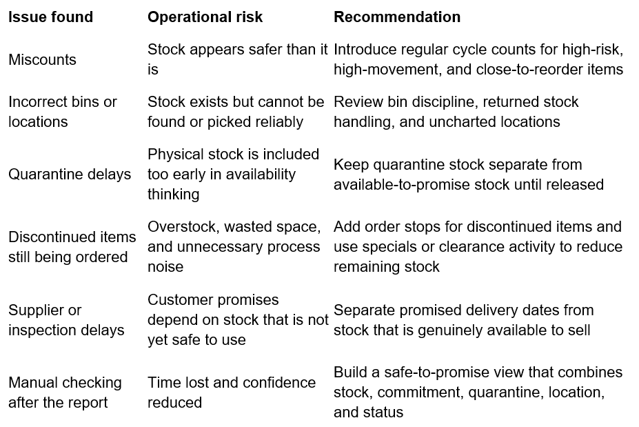

Below is a draft README in the same style as your existing template, adapted for the NorthBridge ERP stock trust case study. I’ve kept it grounded, case-study led, and clear that the company/data are fictional but realistic.

---

# ERP Stock Trust Gap & Safe-to-Promise Reporting



## Overview

This project explores a common ERP reporting problem:

> The stock report says stock is available, but the warehouse team still checks manually before trusting it.

Using a fictional but realistic SME distribution company, **NorthBridge Maintenance Supplies Ltd**, this case study examines the gap between management-level stock reporting and warehouse-level operational reality.

The project was built around synthetic ERP-style inventory data for a maintenance and industrial supplies distributor. The dataset includes item master data, stock by warehouse/bin location, quarantine stock, discontinued item flags, stock count corrections, order corrections, and trust-status logic.

The original dashboard started as a stock availability view. It showed physical stock, quarantine stock, discontinued stock quantity, and decision-ready available stock.

However, once warehouse corrections and operational conditions were included, the question changed.

The project moved from a simple stock dashboard into a case study about whether ERP stock data is trustworthy enough to support customer promises.

The project demonstrates a realistic business intelligence workflow:

CSV files → Power BI data model → DAX measures → corrected stock logic → dashboard visuals → executive case study PDF

The analysis was designed as a practical reporting and decision-support case study suitable for:

* SME distribution environments,
* ERP / SAP Business One reporting demonstrations,
* warehouse and stock-control conversations,
* safe-to-promise reporting,
* Power BI portfolio work,
* operational process improvement discussions,
* and management reporting trust reviews.

---

# The Problem

A stock report can look acceptable at management level while still being difficult to trust on the warehouse floor.

NorthBridge Maintenance Supplies Ltd appeared to have a reasonable stock position. The dashboard identified:

* 57.33K clean physical stock
* 24.17K corrected decision-ready stock
* 335 units in quarantine stock
* 2.50K discontinued stock quantity

At headline level, the business looked broadly under control.

But warehouse staff knew the operational reality was more complicated.

They were still:

* checking bins manually,
* working around stock in quarantine,
* seeing discontinued items continue to create order noise,
* managing supplier and inspection delays,
* correcting stock count issues,
* and finding returned stock in incorrect or uncharted warehouse locations.

The key business problem was not simply whether stock existed.

The key question was:

> Can the ERP stock report be trusted enough to promise delivery from it?

This reflects a common reporting and control challenge:

> Physical stock is not the same as stock that is safe to promise.

A business can carry stock on the system and still risk poor customer promises if that stock is committed, quarantined, discontinued, incorrectly located, miscounted, delayed, or dependent on supplier activity that has not yet happened.

---

# The Approach

The project used a synthetic ERP-style dataset built around a fictional SME distributor: **NorthBridge Maintenance Supplies Ltd**.

The business supplies maintenance parts, PPE, cleaning consumables, electrical items, plumbing fittings, packaging supplies, tools, and mechanical spares.

The data model included:

* item master data,
* product groups,
* active/discontinued status,
* warehouse/bin locations,
* physical stock,
* committed stock,
* on-order stock,
* quarantine stock,
* reorder levels,
* stock count corrections,
* order corrections,
* and stock trust flags.

The analysis developed in stages.

## Stage 1: Standard ERP Stock View

The first stage created a basic stock reporting view showing:

* physical stock,
* committed stock,
* quarantine stock,
* decision-ready available stock,
* discontinued stock quantity,
* reorder levels,
* and stock trust status.

This showed useful stock visibility, but it did not fully explain whether the report could be trusted operationally.

## Stage 2: Cleaned Stock Position

The second stage addressed duplicate and repeated stock-location records.

Some items appeared more than once for the same item and warehouse/bin combination. In some cases, this reflected valid operational complexity. In other cases, it created a risk of overstating physical stock.

The dashboard therefore introduced cleaned stock measures that summarised stock at the correct grain:

> ItemCode + Warehouse / Bin Location

This helped prevent duplicate rows from inflating the stock position.

## Stage 3: Corrections and Trust Gap

The third stage brought in warehouse correction data.

Correction reasons included:

* miscount,
* incorrect warehouse representation,
* quarantined stock released,
* stock found in incorrect bin,
* discontinued stock order cancelled,
* and not-recorded order sheet found.

Once corrections were applied, some items changed decision status.

For example:

* CC012 Blue Paper Roll moved from **Safe to promise** to **Do not promise**
* EC075 Emergency Stop Button moved from **Safe to promise** to **Do not promise**

This shifted the case study from a stock visibility dashboard into a trust review.

The question became:

> What does the ERP report need to include before sales, warehouse, and management can use it confidently?

---

# The Solution

The Power BI report creates a corrected, decision-ready stock view that separates stock that exists from stock that can safely support a customer promise.

## Power BI Layer

The report uses Power BI and DAX to create measures for:

* clean physical stock,
* clean quarantine stock,
* committed stock,
* corrected physical stock,
* decision-ready available stock,
* corrected decision-ready available stock,
* discontinued stock quantity,
* reorder status,
* stock trust flag,
* and stock trust flag after corrections.

The reporting logic was designed to avoid treating all stock as equally available.

For example, quarantine stock physically exists, but it should not be included in available-to-promise stock until released.

Discontinued stock may be present in the warehouse, but it should not continue to generate routine purchasing or sales-order noise.

Stock in the wrong bin may be visible in the system, but not reliably pickable by the warehouse team.

## Correction Layer

The correction layer was kept visible because the correction reasons are part of the business story.

The project does not simply adjust the final stock number and hide the operational cause.

Instead, it uses correction reasons to explain why the original stock report needed checking.

This makes the dashboard useful for both:

* management review,
* and warehouse/process improvement.

---

# Dashboard Highlights

## Executive Stock Trust Dashboard

The executive view focuses on the gap between stock that exists and stock that can safely support decisions.

It includes:

* clean physical stock,
* corrected decision-ready stock,
* quarantine stock,
* discontinued stock quantity,
* and product group comparison of clean physical stock versus corrected decision-ready stock.

The key finding was:

> The headline stock position looked acceptable, but the decision-ready stock position was much narrower.

This matters because management totals can create comfort before the warehouse has confidence.

A physical stock figure is not enough when teams need to decide whether they can safely promise delivery to a customer.

## Item-Level Trust View

The item-level view compares original decision-ready stock with corrected decision-ready stock.

This view highlights items where the status changed after operational corrections were included.

Two examples made the issue clear:

* **CC012 Blue Paper Roll** originally showed 55 decision-ready units and was flagged as **Safe to promise**. After correction, it moved to -60 corrected decision-ready units and became **Do not promise**.
* **EC075 Emergency Stop Button** moved from 55 decision-ready units and **Safe to promise** to -8 corrected decision-ready units and **Do not promise**.

The strongest finding was:

> Some items only looked safe before warehouse reality was included.

## Correction Reasons View

The correction page explains why the ERP report was being checked manually.

It includes:

* correction count by reason,
* correction count by warehouse/bin,
* stock count correction records,
* order correction records,
* corrected physical stock,
* corrected on-order stock,
* and correction reason notes.

This page supports process recommendations rather than simply reporting final numbers.

Good reporting does not only show that something changed. It helps explain why the change matters.

---

# Key Findings

The analysis identified several important findings.

## 1. Physical Stock Was Not the Same as Safe-to-Promise Stock

The business had a meaningful physical stock position, but much less stock was genuinely decision-ready.

Stock could not be treated as safely available without considering:

* committed stock,
* quarantine stock,
* discontinued status,
* correction history,
* reorder level,
* and location reliability.

## 2. Warehouse Corrections Changed the Decision

Some items that were originally marked as safe became do-not-promise items after correction.

This shows why warehouse staff were right to check the report manually.

The issue was not resistance to the system.

The issue was that the system view did not yet carry enough operational context.

## 3. Quarantine Stock Needed Separate Treatment

Quarantine stock physically existed, but it was not safe to promise until released.

Including quarantine stock too early can create false confidence in availability.

This is especially important for items requiring checks, inspection, or release before use.

## 4. Location Accuracy Was a Reporting Issue, Not Just a Warehouse Issue

The correction records showed examples of incorrect warehouse representation and stock found in the wrong bin.

This matters because stock in the wrong location can still appear in the ERP report.

From the system’s point of view, the stock may exist.

From the warehouse’s point of view, it may not be findable, pickable, or safe to promise.

## 5. Discontinued Items Created Avoidable Stock Noise

Discontinued items still appeared in the stock and order process.

This creates risks including:

* unnecessary purchasing,
* warehouse space pressure,
* sales confusion,
* unclear run-down planning,
* and avoidable exception handling.

Discontinued stock needs a clear order-stop and run-down process.

## 6. Promised Delivery Dates Were Not Enough

A supplier promise or expected delivery date should not be treated as available stock.

A patient customer may tolerate delay, but that does not make the stock safe to sell.

If supplier delays, quarantine checks, and inspection holds happen regularly, a single optimistic date can create a chain of fragile customer promises.

---

# Operational Recommendations

The analysis led to six practical recommendations.

## 1. Create a Safe-to-Promise Stock View

NorthBridge should separate physical stock from stock that can genuinely support a customer promise.

The reporting view should include:

* physical stock,
* committed stock,
* quarantine stock,
* discontinued stock,
* corrected stock position,
* reorder status,
* and correction history.

This gives sales, warehouse, and management a shared view of what can safely be promised.

## 2. Introduce Regular Cycle Counts for Risk Items

Cycle counts should prioritise items that are:

* high movement,
* close to reorder level,
* frequently corrected,
* held in quarantine,
* stored across multiple locations,
* or linked to customer delivery issues.

This is not only a stock-control task. It protects customer promises.

## 3. Improve Bin and Location Discipline

NorthBridge should review:

* returned stock handling,
* uncharted or informal bin use,
* bin labelling,
* quarantine movement,
* stock moved without ERP updates,
* and mismatch between ERP locations and physical warehouse layout.

The ERP cannot support reliable decisions if the warehouse has locations the report does not understand.

## 4. Keep Quarantine Separate From Available-to-Promise Stock

Quarantine stock should remain outside promise-ready stock until it has been released.

The dashboard should clearly distinguish:

* physically present,
* in quarantine,
* released,
* and available-to-promise.

This prevents stock from being promised before inspection or release is complete.

## 5. Add Order Stops for Discontinued Items

Discontinued items should have clear controls.

NorthBridge should consider:

* blocking new purchase orders,
* flagging discontinued items still holding stock,
* reviewing open sales orders,
* using specials or clearance activity to reduce remaining stock,
* and excluding discontinued items from routine replenishment reporting.

This helps reduce overstock, warehouse clutter, and unnecessary process noise.

## 6. Separate Supplier Promise From Customer Promise

Expected supplier delivery dates should not automatically become customer promise dates.

Reporting should flag items where availability depends on:

* supplier delivery,
* inspection,
* quarantine release,
* correction activity,
* or manual warehouse intervention.

This helps sales teams understand when a promise is firm and when it still carries operational risk.

---

# Data Limitations

This case study uses fictional but realistic data.

It should not be treated as a live client audit or a complete ERP implementation review.

The analysis does not prove:

* stock loss,
* warehouse failure,
* supplier failure,
* inaccurate accounting,
* or poor staff performance.

It shows that stock reporting can become unreliable for decisions when the report does not include enough operational context.

The dashboard identifies trust gaps and exception patterns. In a real business, the next step would be to validate these findings against live ERP data, warehouse processes, stock count records, purchasing controls, and user behaviour.

The most useful conclusion is therefore:

> The available stock report may be accurate as a system record, but not yet complete as a decision-support view.

This distinction matters.

The report can show what exists.

The business still needs to know what it can trust.

---

# Demo

The repository includes:

* synthetic item master CSV,
* synthetic inventory CSV,
* stock count correction CSV,
* order correction CSV,
* Power BI dashboard screenshots,
* Power BI dashboard PDF export,
* executive case study PDF,
* README documentation,
* and operational recommendations.

Suggested walkthrough order:

1. Review the item master file
2. Review the inventory file
3. Review the stock count correction file
4. Review the order correction file
5. Open the Power BI dashboard
6. Review the executive stock trust page
7. Review the item-level before-and-after trust view
8. Review the correction reasons page
9. Read the executive case study PDF

---

# How to Run

## Requirements

* Power BI Desktop
* CSV source files included in this repository

## Steps

1. Download or clone the repository

```bash
git clone https://github.com/ingeborgbevers-blip/ERPreportvsExcel
```

2. Open the Power BI file in Power BI Desktop

```text
NorthBridge_ERP_Stock_Trust_Gap.pbix
```

3. Check data source settings

If needed, update the CSV file paths in Power Query to match your local folder.

4. Refresh the report

Use Power BI Desktop refresh to reload the CSV data.

5. Review the dashboard pages

Recommended order:

* Executive stock trust view
* Item-level trust comparison
* Correction reasons view

6. Review the executive case study PDF

Use the PDF to understand the business question, findings, and recommendations.

---

# Suggested Business Use

This case study demonstrates how an SME could move from basic ERP stock reporting to a more decision-ready stock trust view.

It is relevant where managers need to understand:

* why warehouse staff still check reports manually,
* whether stock is genuinely available to promise,
* where quarantine or inspection delays affect availability,
* whether discontinued items are still creating unnecessary order activity,
* whether bin/location issues are weakening trust,
* and whether sales, warehouse, and management are working from the same definition of availability.

The project also demonstrates the value of not stopping at the headline stock number.

The first view showed stock.

The better view showed whether the stock could be trusted.

That is where reporting becomes decision support.

---

# Tools Used

* Power BI Desktop
* Power Query
* DAX
* CSV data modelling
* Synthetic ERP-style dataset
* GitHub
* Kaggle
* PDF case study export

---

# Project Status

Completed as a portfolio case study.

Potential future improvements include:

* adding sales order line detail,
* adding purchase order line detail,
* modelling supplier lead-time reliability,
* adding customer promise-date analysis,
* adding stock ageing and dead-stock value,
* adding warehouse movement history,
* adding a formal exception workflow,
* and recreating the analysis with real ERP/SAP Business One data where permitted.
